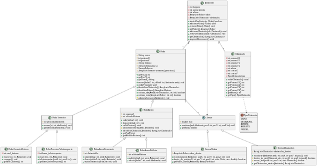

# Descrição
Esse repositório apresenta os laboratórios de MC322, com o objetivo de gerar um código capaz de construir classes de robôs, juntamente com um ambiente interativo entre os objetos criados.
## Dados do projeto:
  * IDE: VSCode
  * Versão Java: openjdk 21.0.5 2024-10-15
  * OpenJDK Runtime Environment (Red_Hat-21.0.5.0.11-1) (build 21.0.5+11)
  * OpenJDK 64-Bit Server VM (Red_Hat-21.0.5.0.11-1) (build 21.0.5+11, mixed mode, sharing)

# Classes
  ## Robô
  Classe genérica de robôs, implementa os atributos base, função base e cria os sensores para as funções necessários para o robô mover
  ### Robo Terrestre
  Subclasse de robô que implementa uma velocidade máxima de deslocamento do robô
  * **Robô Terrestre Eletrico**: Implementa bateria e recarga para o robô
  * **Robô Terrestre Teletransporte**: Implementa a barra de teletransporte e o método de teletransporte
  ### Robô Aéreo
  Subclasse de robô que implementa o deslocamento no eixo Z e um limite de altura
  * **Robô Aéreo Consciente**: impede que ele se aproxime muito de robos e obstaculos, implementa os sensores de robos e obstaculos 
  * **Robô Aéreo Refletor**: reflete o que ele iria ultrapassar a altura máxima
  ## Sensor
  Classe genérica dos sensores, que contém o raio de monitoramento e a função abstrata monitorar
  * **Sensor Robôs**: Sensor que monitora robôs dentro do raio, usa o ambiente para achar os roboôs
  * **Sensor Obstáculos**: Sensor que acha os obstáculos próximos
  ## Ambiente
  Classe que abriga os objetos criados: robôs, obstáculos e seus limites
  ## Obstáculo
  Classe que contém objetos que compõe o ambiente
  
## Como executar:
  - Abre o terminal e navegue para a pasta com o laboratório que você deseja rodar (certifique-se de que você está na pasta correta)
  - Utilize o comando "javac *.java" para compilar todos os arquivos java dentro da pasta com o laboratório desejado
  - Rode a classe Main com o comando "java Main"

## Diagrama de classes:
