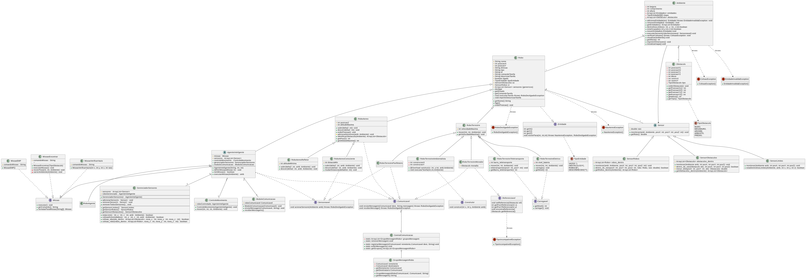

# Descrição
Esse repositório apresenta os laboratórios de MC322, com o objetivo de gerar um código capaz de construir classes de robôs, juntamente com um ambiente interativo entre os objetos criados.
## Dados do projeto:
  * IDE: VSCode
  * Versão Java: openjdk 21.0.5 2024-10-15
  * OpenJDK Runtime Environment (Red_Hat-21.0.5.0.11-1) (build 21.0.5+11)
  * OpenJDK 64-Bit Server VM (Red_Hat-21.0.5.0.11-1) (build 21.0.5+11, mixed mode, sharing)
# Classes
  ## Robô
  Classe genérica de robôs, implementa os atributos base, função base e cria os sensores para as funções necessários para o robô mover
  ### Robo Terrestre
  Subclasse de robô que implementa uma velocidade máxima de deslocamento do robô
  * **Robô Terrestre Eletrico**: Implementa bateria e recarga para o robô
  * **Robô Terrestre Teletransporte**: Implementa a barra de teletransporte e o método de teletransporte
  * **Robô Terrestre Morador**: Implementa a interface referenciavel com o intuito de atribuir as coordenadas de um obstaculo do tipo moradia (casa ou predio) no metodo executarTarefa
  * **Robô Terrestre Panfletario**: Robô que aplica as interfaces comunicavel e sensoreavel para encontrar Robôs Moradores e mandar mensagens de anuncio de moradia.
  ### Robô Aéreo
  Subclasse de robô que implementa o deslocamento no eixo Z e um limite de altura, e implementa a recepção de mensagens
  * **Robô Aéreo Consciente**: Manda mensagem para os robos muito proximos, implementa o sensor de robos
  * **Robô Aéreo Refletor**: reflete o que ele iria ultrapassar a altura máxima
  ### Agente Inteligente
  Classe abstrata que representa Robôs capazes de executar missoes, implmentando as interfaces sensoreavel e comunicavel. Alem disso, ele eh composto por subsistemas capazes de dar autonomia para o robo realizar as tarefas sem a presenca do usuario.
  * **Robô Agente**: classe concreta capaz de executar missoes 
  ## Sensor
  Classe genérica dos sensores, que contém o raio de monitoramento e a função abstrata monitorar
  * **Sensor Robôs**: Sensor que monitora robôs dentro do raio, usa o ambiente para achar os roboôs
  * **Sensor Obstáculos**: Sensor que acha os obstáculos próximos
  * **Sensor Limites**: Sensor que monitora as extremidades do ambiente
  ## Ambiente
  Classe que abriga as entidades criadas: robôs, obstáculos, vazio ou indeterminada, juntamente com os seus limites.
  ## Obstáculo
  Classe que contém objetos que compõe o ambiente
  ## Missao
  Interface que atribui tarefas especificas para robos inteligentes, além de criar um arquivo com o log da missao
  No menu interativo, a atribuição de missões é realizada quando há um RoboAgente selecionado e se utiliza o comando de atribuição de missões (ram) e o comando da missão com as informações adicionais dela, que podem ser vistas pelo comando de listar missões (rdm).
  Ex: ram VERVAZIO 10 20 30
  ### MissaoEMP
  O robo com essa missao inverte o estado de todos os robos no raio do seu sensor de robos, e envia uma mensagem para os comunicáveis avisando isso
  ### MissaoEncontrar
  Nessa missao o robo encontra um tipo de obstaculo especifico
  ### MissaoVerificarVazio
  Verifica se a posicao escolhida esta vazia
  ## Interfaces
  ### Carregavel
  Interface para robos que dependem que algum componente carregavel para funcionar (RoboTerrestreEletrico, RoboTerrestreTeletransporte)
  ### Comunicavel
  Interface implementada para robos que utilizam a classe **CentralDeComunicacao** para enviar e receber mensagens (RoboAereo, RoboTerrestrePanfletario, RoboTerrestreMorador)
  ### Sensoreavel
  Implementada em robos que contem sensores (RoboAereoConsciente, RoboTerrestrePanfletario)
  ### Entidade
  Generaliza os objetos do ambiente, adicionando metodos capazes de mapinular e distinguir as entidades existentes (Robo, Obstaculo)
  ### Construtor
  Interface dos objetos com capacidade de contruir no ambiente (RoboTerrestreAmbientalista)
  ### Referenciavel
  Interface que atrela um obstáculo a um objeto referenciavel (RoboTerrestreMorador)
  ## Subsistemas
  Classes capazes de dar autonomia ao Robô 
  ### ControleMovimento
  Controla os movimentos do Robô, alterando as suas coordenadas internas e as relacionadas ao ambiente
  ### GerenciadorSensores
  Controla os sensores e realiza as tarefas necesssarias para dar autonomia ao Robô, como verificar se o espaco no qual o robo ira se deslocar esta vazio
  ### ModuloComunicacao
  Controla e gerencia a comunicacao dos Robôs, recebimento e envio de mensagens
  ## Exceptions
  ### TipoIncompativel
  Para evitar acoplamento de tipos de classes invalidas a objetos que dependem de tipo especificos (como colocar um obstaculo de tipo ARVORE quando só poderia ser CASA ou PREDIO)
  ### Colisao
  Acionada toda vez que houver iminencia de colisao
  ### EntidadeInvalida
  Acionada quando há a tentativa de adicionar uma entidade nao válida no Ambiente (como uma entidade adicionada em uma posição já ocupada)
  ### NaoAereo
  Acionada para a tentativa de  mover robos terrestres no eixo z
  ### RoboDesligado
  Acionada quando um metodo tenta interagir com um robo desligado

## Menu Interativo
  O menu interativo imprime os comandos gerais possíveis no ambiente. Os comandos relacionados aos robos só são impressos quando já há um robo selecionado e se utiliza "rh". Os comandos da tarefa específica de cada robo e a descrição do comando estão inclusos na própria declaração da classe de cada robo como variáveis string, que são utilizadas pelo código do menu
  
## Como executar:
  - Abra o terminal e navegue para a pasta com o laboratório que você deseja rodar (certifique-se de que você está na pasta correta)
  - Utilize o comando "javac *.java" para compilar todos os arquivos java dentro da pasta com o laboratório desejado
  - Rode a classe Main com o comando "java Main"

## Diagrama de classes:
O diagrama foi feito em puml. A conexão entre os elementos do diagrama foi feita considerando as relações entre as classes no código (Ex: Cada ambiente tem muitos robôs, então foi feita uma relação de composição de um para muitos). As relações de herança foram representadas com setas. A classe abstrata Sensor foi destacada com um "A", enquanto as classes concretas foram marcadas com um "C". Para o enum não ficar completamente desconexo das outras classes, ele foi conectado à classe Obstáculo no diagrama. 

